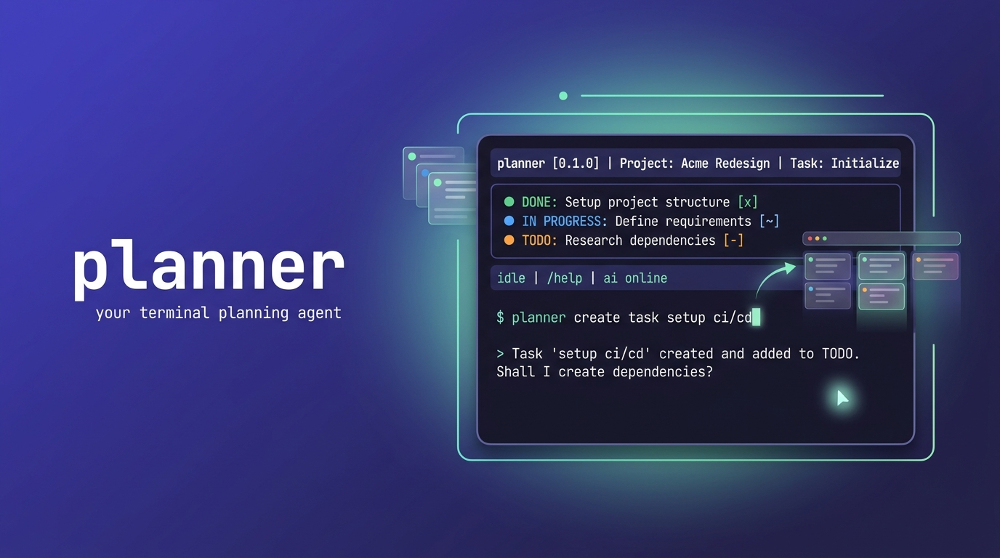

# planner



A personal planning agent: a terminal chat harness backed by an LLM with tools
that keep a local SQLite task board in sync with a self-hosted
[Plane](https://plane.so) instance, plus daily digests delivered to Telegram.

You talk to it in natural language ("empecé la migración de DNS", "posterga la
tarea 4", "creá 30 tareas repartidas en junio"), and it drives the board through
deterministic tools. It also works without the LLM through slash-commands.

---

## Build & run

```bash
go build -o planner ./cmd/planner   # build a binary
# or run directly:
go run ./cmd/planner                # start the chat harness (default)
```

Subcommands:

| Command          | What it does                                             |
| ---------------- | -------------------------------------------------------- |
| `planner`        | Start the interactive chat harness (default)             |
| `planner tui`    | Alias for the chat harness                               |
| `planner config` | Open the configuration TUI (providers, Plane, Telegram)  |
| `planner help`   | Show usage                                               |

Files (under `~/.config/planner/`, override the config path with
`PLANNER_CONFIG`):

- `config.json` — providers, keys, Plane, Telegram, favorites
- `planner.db` — SQLite: tasks, conversations, dailies

---

## First-time setup (`planner config`)

The config is a **sections menu**. Move with `↑/↓`, `enter` opens a section,
`esc` goes back, `s` saves, `q` quits. Each section shows `✓`/`✗` readiness.

Inside a section, `enter` edits a text field, cycles a `‹ choice ›`, or runs an
action (`↻`/`✈`). Secrets are masked.

### Providers

Two general settings on top — **context budget** (chars kept in the LLM window)
and **memory project** (Engram project, blank = autodetect) — then a **list of
providers**. Each row shows the active marker (`▸`), a key marker (`●` set /
`○` unset), the name and the model.

`enter` on a provider drills into it: set its **model**, paste its **api key**,
and **✓ set as active provider**. `esc` goes back to the list.

Built-in providers: `ollama` (local, default, free), `openai`, `moonshot`,
`kimi`, `groq`, `claude`. Just configure the one you use and activate it.

### Plane

1. Fill **base url**, **api token**, **workspace slug**, **project id**,
   optional **default estimate**.
2. Run **↻ fetch states from Plane** — pulls the project's workflow states.
3. A **default · <group>** picker appears per state group; choose which concrete
   state each of Plane's five groups (backlog / unstarted / started / completed /
   cancelled) maps to. This is what moves the card's column when a task's status
   changes.
4. `s` to save.

### Telegram

Fill **bot token**, **chat id**, optional **thread id**, then run
**✈ send test notification** to confirm delivery end-to-end.

---

## Using the harness

Type a message to talk to the agent, or `/` for the command menu (with
autocomplete). Tasks carry a **type** (`FEAT`, `FIX`, `HOTFIX`, `TEST`, `EPIC`),
a short **title**, an internal **label**, a semantic **status**, and optional
activity-template details (objective, acceptance criteria, etc.).

### Keys

| Key                     | Action                                            |
| ----------------------- | ------------------------------------------------- |
| `enter`                 | send message / run command                        |
| `alt+enter`             | newline (multi-line input)                        |
| `↑` / `↓`               | recall input history (single-line)                |
| `pgup` / `pgdn` / wheel | scroll the conversation                           |
| click + drag            | select text (character-granular)                  |
| right-click             | copy the current selection to the clipboard       |
| `esc`                   | cancel a selection / close the suggestion menu    |
| `ctrl+l`                | clear the on-screen content (keeps context)       |
| `tab` / `enter`         | complete a highlighted suggestion                 |
| `ctrl+c`                | once clears the prompt, twice quits               |
| `y` / `n`               | confirm / cancel a pending destructive action     |

Selection is anchored to the conversation content, so you can scroll while
selecting and the range is preserved beyond what's visible. It does not copy on
release: **right-click** copies the highlighted text (with a confirmation toast),
and any key (or `esc`) cancels it.

### Commands

**Tasks**

- `/todo [all|<status>] [hoy|ayer]` — list tasks grouped by status. Bare shows
  in-progress (any day) plus today's todo/done; `all` lists everything; a status
  flag filters, and an optional day flag narrows to that day
- `/task <id>` — show one task in full (template sections, dates, priority)
- `/new <TYPE> <title>` — create a task without the LLM
- `/status <id> <status>` — move a task between Plane's 5 state groups
  (`backlog`, `unstarted`, `started`, `completed`, `cancelled`). The concrete
  Plane state within a group (e.g. "Devuelto por Calidad") is set with `/state`.
- `/state <id>` — pick a real Plane state from a menu (needs a prior state fetch)
- `/drop <id> [sync]` — delete a task; `sync` also removes the Plane work item
  (asks for confirmation)

**Plane sync**

- `/sync` — push every local task to Plane (reports per-task failures)
- `/pull` — pull states back from Plane for synced tasks

On push, a task becomes a Plane work item titled `[TYPE] - #<code> - <title>`,
with a rich-text body from its template fields, a label matching its type, a
priority derived from its type (HOTFIX→urgent, FIX→high, else medium), and its
start/due dates (defaulting to today / tomorrow).

**Dailies**

- `/daily` — generate today's digest (LLM-written narrative: Trabajo / Bloqueos
  / Notas), stored as a draft
- `/daily <date> [instruction]` — generate for `today`/`hoy`, `yesterday`/`ayer`,
  or `YYYY-MM-DD`; the optional instruction and any prior stored draft are fed to
  the model so previous edits are respected
- `/daily edit [date]` — edit the draft inline (`enter` saves, `esc` cancels)
- `/daily send [date]` — send the draft to Telegram
- `/dailies` — list stored dailies

**LLM / providers**

- `/model [name]` — switch the active provider
- `/fav [save|del] <name>` — save / switch / remove a provider+model favorite
- `/key <provider> <apikey>` — set and save an API key

**Conversations & memory**

- `/save [title]` — save the current conversation
- `/chats` — list saved conversations
- `/load <id>` — restore a conversation
- `/resume` — reopen the most recent conversation
- `/newchat` — start fresh
- `/recall <query>` — search long-term memory (Engram, if installed)
- `/remember <note>` — save a note to long-term memory

**Projects & people**

- `/projects` — list projects (`+slug`)
- `/project <slug>` — show a project. `new <slug> [description]` creates it;
  `<slug> note [info|decision|change] <text>` appends context
- `/people` — list people (`@nick`)
- `/person <nick>` — show a person. `new <nick> [role]` creates it;
  `<nick> note [info|decision|change] <text>` appends context

Projects and people accumulate context (info, decisions, changes). The agent
persists it for you with its `upsert_project` / `add_project_note` /
`upsert_person` / `add_person_note` tools when you say things like "guardá que
+liquida migró a PHP 8.3" or "@kari es Karime del área comercial".

**Session**

- `/clear` — clear the on-screen conversation and agent history
- `/help` — list commands
- `/quit` — exit

---

## Architecture (ports & adapters)

```
cmd/planner            entrypoint: chat · tui · config
internal/domain        Task, TaskType, Status (our semantic layer over Plane states)
internal/llm           Provider port + adapters (openai/moonshot/kimi/groq/claude/custom)
internal/store         TaskStore/ConversationStore/DailyStore ports + SQLite adapter (pure Go)
internal/tools         LLM tool set → deterministic ops on the store
internal/agent         tool-use loop + stateless Oneshot (for dailies)
internal/contextmgr    trims the LLM window to a char budget
internal/memory        Engram long-term memory (CLI shell-out) or no-op
internal/plane         Plane REST client + push/pull syncer
internal/telegram      Telegram Bot API client (daily delivery)
internal/config        JSON config (providers, Plane, Telegram, favorites)
internal/tui           Bubbletea chat harness + config TUI
```

The core depends only on the ports, so swapping the LLM, storage, or delivery
channel is an adapter change, not a rewrite.

---

## Test

```bash
go test ./...
```

Adapters (LLM, Plane, Telegram) are tested against `httptest` servers — no live
API calls; the store, tools, and TUI helpers run against a temp SQLite file.

---

## Notes

- **Local-first sync**: mutations always land locally; a failed Plane push never
  fails the local operation. Use `/sync` to retry and see errors.
- **Memory**: if the `engram` CLI is installed, recall/remember and the memory
  tools light up automatically; otherwise they're inert.
- **Clipboard**: copy-on-select uses the system clipboard (needs
  `xclip`/`xsel`/`wl-clipboard` on Linux).
